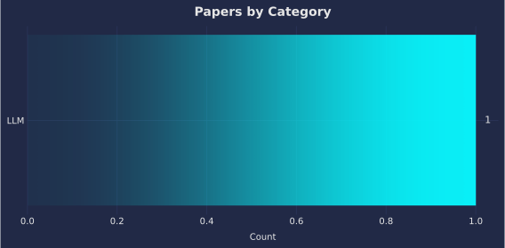
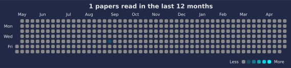

# 📚 Paper Reading Log

Track and visualize your paper reading with auto-updated charts.

<!--CHART_START-->





**Breakdown**

| Category | Count |
|---|---|
| LLM | 40 |
| Multimodal (T/S) | 33 |
| TTS | 23 |
| NAC | 13 |
| ML | 7 |
| Speech | 7 |
| ASR | 5 |
| Dataset (Speech) | 5 |
| Multimodal (T/I) | 5 |
| Multimodal (T/S/I/V) | 3 |
| ST | 2 |
| VC | 2 |
| Audio | 1 |
| Image | 1 |
| Multimodal (T/S/I) | 1 |
| Multimodal Generation | 1 |
| NV | 1 |
| Text Embedding | 1 |
| THG | 1 |
| TTI | 1 |
| **Total** | **153** |

**Recently read**

- [On the Language and Gender Biases in PSTN, VoIP and Neural Audio Codecs](https://www.isca-archive.org/interspeech_2025/altwlkany25_interspeech.pdf) — *Speech* (2025-10-21)
- [Understanding the Modality Gap: An Empirical Study on the Speech-Text Alignment Mechanism of Large Speech Language Models](https://arxiv.org/abs/2510.12116) — *Multimodal (T/S)* (2025-10-20)
- [LongCat-Audio-Codec: An Audio Tokenizer and Detokenizer Solution Designed for Speech Large Language Models](https://github.com/meituan-longcat/LongCat-Audio-Codec/blob/main/tech_report.pdf) — *NAC* (2025-10-19)
- [SpeechLLM-as-Judges: Towards General and Interpretable Speech Quality Evaluation](https://arxiv.org/abs/2510.14664) — *Multimodal (T/S)* (2025-10-18)
- [Do LLMs "Feel"? Emotion Circuits Discovery and Control](https://arxiv.org/abs/2510.11328) — *LLM* (2025-10-17)
- [ZIPA: A family of efficient models for multilingual phone recognition](https://aclanthology.org/2025.acl-long.961.pdf) — *Speech* (2025-10-16)
- [The taste of IPA: Towards open-vocabulary keyword spotting and forced alignment in any language](https://aclanthology.org/2024.naacl-long.43.pdf) — *Speech* (2025-10-16)
- [IndicSynth: A Large-Scale Multilingual Synthetic Speech Dataset for Low-Resource Indian Languages](https://aclanthology.org/2025.acl-long.1070.pdf) — *Dataset (Speech)* (2025-10-15)
- [Full-Duplex-Bench-v2: A Multi-Turn Evaluation Framework for Duplex Dialogue Systems with an Automated Examiner](https://arxiv.org/abs/2510.07838) — *Multimodal (T/S)* (2025-10-14)
- [Byte Latent Transformer: Patches Scale Better Than Tokens](https://aclanthology.org/2025.acl-long.453.pdf) — *LLM* (2025-10-13)
<!--CHART_END-->

## How to add a new paper

Add paper info to `data/papers.yml` in the following format:

```yaml
- title: "Your paper title"
  category: "LLM"
  date: "YYYY-MM-DD"
  link: "https://..."
```

## Reuse This Repo

- Use as template: Click "Use this template" on GitHub, then edit `data/papers.yml`.
- Timezone: Set `PAPERS_TZ` in the workflow (default `Asia/Tokyo`).
- CI validation: The workflow validates `data/papers.yml` before building charts.
- Export: CI also writes a machine-readable `data/papers.json` for reuse.

See `TEMPLATE.md` for details.

## Development

With `uv` (recommended):

```
uv sync
uv run scripts/validate_papers.py
uv run scripts/build_readme.py
uv run scripts/export_json.py
```

## License

- Code: MIT (`LICENSE`)
- Content (notes, `data/papers.yml`, generated charts in `assets/`): CC BY 4.0 — https://creativecommons.org/licenses/by/4.0/
