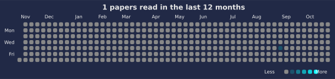

# 📚 Paper Reading Log

Track and visualize your paper reading with auto-updated charts.

<!--CHART_START-->





**Breakdown**

| Category | Count |
|---|---|
| LLM | 1 |
| **Total** | **1** |

**Recently read**

- [Attention Is All You Need](https://arxiv.org/abs/1706.03762) — *LLM* (2025-09-04)
<!--CHART_END-->

## How to add a new paper

Add paper info to `data/papers.yml` in the following format:

```yaml
- title: "Your paper title"
  category: "LLM"
  date: "YYYY-MM-DD"
  link: "https://..."
```

## Reuse This Repo

- Use as template: Click "Use this template" on GitHub, then edit `data/papers.yml`.
- Timezone: Set `PAPERS_TZ` in the workflow (default `Asia/Tokyo`).
- CI validation: The workflow validates `data/papers.yml` before building charts.
- Export: CI also writes a machine-readable `data/papers.json` for reuse.

See `TEMPLATE.md` for details.

## Development

With `uv` (recommended):

```
uv sync
uv run scripts/validate_papers.py
uv run scripts/build_readme.py
uv run scripts/export_json.py
```

## License

- Code: MIT (`LICENSE`)
- Content (notes, `data/papers.yml`, generated charts in `assets/`): CC BY 4.0 — https://creativecommons.org/licenses/by/4.0/
